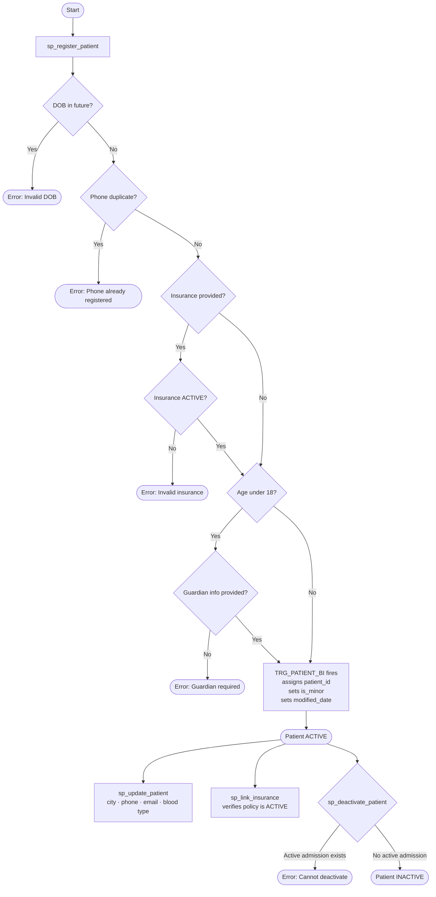

# Hospital Management System — Patient Module

An Oracle PL/SQL database system for managing hospital patient operations including registration, insurance, appointments, admissions, billing, and payments.

**Git Repository:** https://github.com/ArvindRanganathRaghuraman/HospitalManagementPatientSystem

---

## Module Scope

This module covers the full patient lifecycle from registration through discharge and billing. It is one component of a larger Hospital Management System, implemented as an independent Oracle schema (`HMS_OWNER`) with role-based access control.

---

## Patient Management Workflow



## Database Schema

### Tables

| Table | Description |
|---|---|
| `insurance` | Insurance providers with coverage percentage and active/expired/inactive status |
| `patient` | Core patient records — demographics, guardian info for minors, insurance linkage |
| `appointment` | Scheduled visits with doctor, date, time, status, and reason |
| `admission` | Inpatient admissions linked to appointments or emergency walk-ins |
| `prescription` | Prescription records linked to an appointment |
| `prescription_item` | Individual medications within a prescription |
| `bill` | Financial record per patient — service, room, medication charges |
| `payment` | Payments made against a bill |

### Dependency Order (FK chain)

```
insurance → patient → appointment → admission
                   → prescription → prescription_item
                   → bill → payment
```

---

## Business Rules

### Patient Registration
- Every patient must have a unique phone number — duplicates are rejected
- Date of birth cannot be in the future
- Gender must be M, F, or O
- Blood type, if provided, must be one of: A+, A−, B+, B−, AB+, AB−, O+, O−
- `is_minor` is automatically set by a trigger based on date of birth (under 18 = Y)
- Any patient under 18 must have guardian first name, last name, relationship, and phone recorded

### Insurance
- Only ACTIVE insurance policies can be linked to a patient
- EXPIRED or INACTIVE policies are rejected at registration and at link time
- If no insurance is linked, coverage defaults to 0%

### Billing
- `total_amount` is auto-calculated by trigger as the sum of service, room, medication, and other charges
- Insurance coverage amount is auto-calculated: `total_amount × coverage_percentage / 100`
- `net_amount` = total − insurance coverage − discount
- Net amount cannot go negative — bills that result in a negative net are blocked
- A bill with status PAID cannot be modified

### Admissions
- A patient cannot be deactivated while they have an active (non-discharged) admission
- Admissions can be planned (linked to a prior appointment) or emergency (no appointment)

---

## Stored Procedures and Functions

All procedures and functions are encapsulated in the package `pkg_patient_mgmt`.

### Procedures

| Procedure | What it does |
|---|---|
| `sp_register_patient` | Registers a new patient; validates DOB, phone uniqueness, minor guardian rules, and insurance status |
| `sp_update_patient` | Updates allowed patient fields (city, phone, blood type, email, etc.) |
| `sp_link_insurance` | Links an active insurance policy to an existing patient |
| `sp_deactivate_patient` | Marks a patient as INACTIVE; blocks if active admission exists |

### Functions

| Function | Returns |
|---|---|
| `fn_is_minor(p_patient_id)` | `Y` if patient is under 18, `N` otherwise |
| `fn_get_coverage_pct(p_patient_id)` | Insurance coverage percentage (0 if uninsured) |

---

## Triggers

| Trigger | Table | What it does |
|---|---|---|
| `TRG_PATIENT_BI` | `patient` | Auto-assigns PK from sequence; sets `is_minor` from DOB; sets `modified_date` |
| `TRG_BILL_BI` | `bill` | Auto-calculates `total_amount`, `insurance_coverage_amt`, and `net_amount`; blocks negative net |

---

## Views

| View | Purpose |
|---|---|
| `v_patient_medical_history` | Full patient history — one row per medication per visit, includes guardian info, insurance, admission details |
| `vw_patient_visit_summary` | One row per appointment — all medications collapsed into a single column |
| `vw_patient_profile` | Patient demographics with insurance status flag: INSURED / UNINSURED / INVALID INSURANCE |
| `vw_uninsured_patients` | Patients with no insurance, expired, or inactive policy |
| `vw_minor_patients` | All minors with guardian details and insurance coverage flag |

---

## Security and Roles

| User | Role | Access |
|---|---|---|
| `HMS_OWNER` | Schema owner | Creates and owns all objects |
| `HMS_ADMIN_USER` | `HMS_ADMIN_ROLE` | Full SELECT/INSERT/UPDATE/DELETE on all tables + execute package + read all views |
| `HMS_OP_USER` | `HMS_OPERATOR_ROLE` | Execute package procedures + read views only — no direct table access |

---

